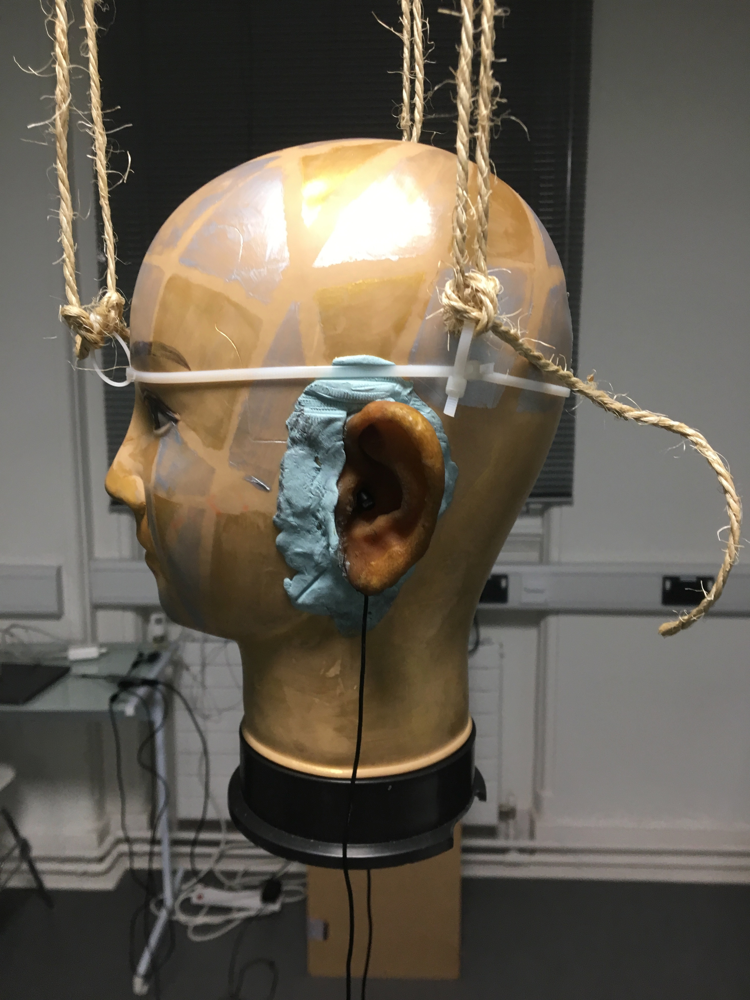

Project Scope
========================

*“The music is not in the notes, but in the silence between.”*

*- Wolfgang Amadeus Mozart*

This Report outlines work done for the 2019 Audio Experience Design Installation
at Imperial College London. Briefly it involved:

* Generating a mixed synthetic and real 3D audio dataset with over 2000 audio clips
* Training a CNN to make heading predictions based on 2 channel audio vectors
* Utilising a probabilistic filter to smooth heading predictions
* Creating an interactive display, with real time audio input, and graphic output

In total, the result of this project was: an interactive audio localisation system, which utilised
live binaural recordings to make predictions on sound source location, and then project
the predicted heading on the floor.

Initial Planning
-------------------------

The initial aims for project were submitted in the preliminary document:

-	**Model Human Audio Localisation**

Fulfilling this criteria was the bulk of the installation work. Ultimately, we were successful
in this endeavour, however, in a simpler case. Humans have the ability to differentiate
between sounds source coming from: the left, right, front or back. Our system could predict left or right with 76% accuracy.

-	**Create an Interactive Dark room, where participants can be localised in real time**

The initial vision was to locate sounds of human foot steps in a dark room, and then shine a
a spot light on their location. Early on in the project, it was suggested that utilising
a projector would simpler then making a custom spotlight. We incorporated this suggestion, and
through testing found that the projector was bright enough to be seen in a light room.

-	**Tie in with educational aspect to explain how our human audio localisation works**

During the Audio Experience day and Dyson Open House we spoke with visitors and explained our installation.

We began our explanation by asking the visitor to close their eyes, and then locate us as we moved around.
The idea was to first illustrate the incredible computation our brains do: localising
sounds in a 3D environment based purely on two auditory signals.

We then explained the process through which this computation is believed to be done (Duplex theory), utilising
inter-aural time difference (ITD) and inter-aural level difference (ILD). Once this introduction finished, we proceeded to demonstrate
our installation which modelled this system computationally.

Inevitably, audience members would walk around the head and see poor performance between front and back localisation.

This would then lead to the discussion of cone of confusion, and we would point out that
the ITD and ILD between front and back are identical. We also took this opportunity to explain
direction dependent filtering done by our pinna's and the role of head movement (at the same time explaining
why our dummy head was rotating around).

Data Generation
-------------------------

The field of *machine listening* is hot. Previous work has utilised large microphone arrays (5+) with custom algorithms and hand picked features [1]
Recent advances in machine learning, however, have made it possible to learn extremely complex functions from data.
These advances are being applied to reach state of the art performance in sound localisation [1].

In line with previous work aimed to train a convolutional neural network (CNN) to predict sound location based on time series audio data. Where to our knowledge we hoped to differ
was in method of generating our data and in utilising only two microphones, mimicking the human system, as suppose to a large microphone array.

3D Tune-In
************

3D Tune-In is an open-source library for real-time binaural spatialisation. Given a mono audio file, it can generate the
corresponding localised stereo recording for a point in space relative to the listener. While this mapping is complex,
for our purposes we assumed it to be a black box. We were interested only in approximating the inverse function.
Given a binaural recording, predict the location of the sound relative to the listener.

The algorithm for the approximation would be a CNN, what was needed was a large dataset.

Data Gen. with MaxSP
*********************

In order to train the CNN, we needed a large dataset with audio clips and corresponding location labels. Rather then generate this
by handing using the offline recording feature in the 3D Tune-In test app, we accomplished this programmatically.

First, I set a 10 min timer and started an online recording in 3D Tune-In. A script in MaxSP, which interfaced with 3D Tune-In using open sound control (OSC),
uniformly iterate through various distance and headings, and moved the sound source. As the recording ran, the max patch would write the sound source's current
location into a text file.

After 10 mins, the online recording and the max patch were stopped. To utilise the data, a function was written to clip the front and end of the audio data, to
ensure it matched with the labels.

**Problems**

Data Gen. with Python
*********************

In order to boost performance, we wanted to make sure that our training data was as close as possible to the test data. I realised we could still interface
using OSC but utilise python to create a more natural motion pattern. Data was recorded in the same manner as described above, but now the sound source was moved
by simulating a random polar walker. This random walker walks in circles around the listener (similar to how we imagined poeple would interact with the dummy head) with various
speeds and accelerations modelled from the average human.

* Average walking speed: 1.4 m/s
* Average walking acceleration over short period of time: 0.86 m/s^2

At each time step, there is a small probability, the walker switches directions.

See code for walker::

  def update(self, dt=0.1):

      #update speed and orientation
      self.timer += dt

      self.r_dot += dt * np.random.normal(0,self.acc_std)
      self.theta_dot += dt * np.random.normal(0,self.acc_std) #in small steps....

      #Move person
      self.r += self.r_dot * dt
      self.theta += self.theta_dot * dt

      # with small probabality switch direction
      if self.timer > 3: # every one second you may switchh

          self.timer = 0

          #with small probability stop, mabye also fixes this unbounded increase problem
          if np.random.random() > 0.8:
              self.theta_dot = 0
          if np.random.random() > 0.8:
              self.r_dot = 0

See walker in action:

.. raw:: html

    

        <iframe src="//www.youtube.com/embed/EC2ePor7Wz0" frameborder="0" allowfullscreen style="position: absolute; top: 0; left: 0; width: 100%; height: 100%;"></iframe>
    

Real Data Generation
*********************

The best data is data taken from the actually test distribution. To generate this dataset, I set up the dummy head and projector as it would be setup on the installation day. I then created
a display that would point to a random heading and let a python script run that captured a sound recording every 30s. Essentially: the computer would tell the person where to stand, the person
would move to that location while making sound, then the computer would capture a sound recording.

The great advantage was that we were capturing the sound features specific to the dummy head we would use in the installation. ITD, IDL and especially the HRTF are greatly affected by the shape of the head,
body and the ears. The most realistic dataset we could have generated in 3D Tune-In would have utlised the publicly available Kemar HRTF, and then we would have used the Kemar in the installation.
Instead we generated a fair amount of syntetic data using the incorrect HRTF, and then fine tuned our model using a large amount of real data recorded on the actually head.

Different Data Types
*********************

Thought was given to what type of sound to use in the data generation. Intially we:

* *Used the same sound.* The model would require less capciacity to localize one sound as suppose to learning to detect the features on man different types of sound.

* *Use constant dB sound*. If the sound level is kept the same, then the model could learn to predict distance

Data pre processing
Data all the same
Normalize but loose distance information. keep the relative information
different label types
Clipping the clips to be of approiate length. The features are very small we are trying to caputure.

CNN, changed the regression to classifier
*****************************************

Loss function not completely straight forward
*********************************************

Haroon,

Display
*********

Sophie did sound.

I altered it to add in this filtering.

Beacuse to noisy data

Probabilistc filter
*********************

histogram display
*******************

[2] Cuevas-Rodríguez M, Picinali L, González-Toledo D, et al., 2019,
3D Tune-In Toolkit: An open-source library for real-time binaural spatialisation,
Plos One, Vol:14, Pages:e0211899-e0211899
´
See `initial proposal here`_

Team coordination tools:
 used messenger, Github and Trello

.. _initial proposal here: https://www.dropbox.com/s/s0ut74x6u8ri9yr/AXP-TeamPingLight.docx?dl=0
