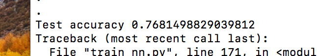
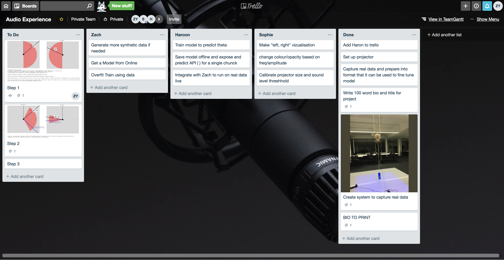

Project Report
========================

*“The music is not in the notes, but in the silence between.”*

*- Wolfgang Amadeus Mozart*

This report outlines work done for the 2019 Audio Experience Design Installation
at Imperial College London. My contribution to this installation involved:

* Generating a mixed synthetic and real 3D audio dataset with over `2000 audio clips`_
* Training a CNN to make heading predictions based on 2 channel audio vectors
* Utilising a probabilistic filter to smooth heading predictions
* Creating an interactive display, with real time audio input, and graphic output

The final result of work was: an interactive audio localisation system, which utilised
live binaural recordings to make predictions on sound source location, and then project
the predicted heading on the floor.

**Dummy Head with two DPA Lapel Mics**

.. figure::  imgs/dummy_head_side.jpg
   :align:   center

.. _2000 audio clips: https://www.dropbox.com/sh/g511lxn3aminor6/AAA7dM8wifHG5ejbL_bbTKA_a?dl=0

Initial Planning
-------------------------

Project Aims
*************

The initial aims for project were submitted in the `preliminary document`_:

-	*Model Human Audio Localisation*

Fulfilling this criteria was the bulk of the installation work. Ultimately, we were successful
in this endeavour, however, in a simpler case. Humans have the ability to differentiate
between sounds source coming from: left, right, front or back. Our system could predict left or right with 76% accuracy (see figure below).

**Test Accuracy of Algorithm**

-	*Create an Interactive Dark room, where participants can be localised in real time*

The initial vision was to locate sounds of human foot steps in a dark room, and then shine a
a spot light on their location. Early on in the project, it was suggested that utilising
a projector would be simpler then making a custom spotlight. We incorporated this suggestion, and
through testing found that the projector was bright enough to be seen, even in a lit room.

-	*Tie in with educational aspect to explain how our human audio localisation works*

During the Audio Experience day and Dyson Open House we spoke with visitors and explained our installation.

We began our explanation by asking the visitor to close their eyes, and then locate us as we moved around.
The idea was to first illustrate the incredible computation our brains do: localising
sounds in a 3D environment based purely on two auditory signals.

We then explained the process through which this computation is believed to be done (Duplex theory), utilising
inter-aural time difference (ITD) and inter-aural level difference (ILD). We then demonstrated
our installation which modelled this system computationally.

Inevitably, audience members would walk around the head and see poor performance between front and back localisation.

This would then lead to the discussion of cone of confusion, and we would point out that
the ITD and ILD between directly in front and back positions are identical. We also took this opportunity to explain
direction dependent filtering done by our ear pinna's and the role of head movement.

Team Coordination
************************

Team coordination was facilitated by: Messenger, `Github`_, Trello

**Trello Board for Task Assignment**

.. _preliminary document: https://www.dropbox.com/s/s0ut74x6u8ri9yr/AXP-TeamPingLight.docx?dl=0
.. _Github: https://www.dropbox.com/s/s0ut74x6u8ri9yr/AXP-TeamPingLight.docx?dl=0

Data Generation
-------------------------

The field of *machine listening* is hot. Previous work has utilised large microphone arrays (5+) with custom algorithms and hand picked features [1].
Recent advances in machine learning, however, have made it possible to learn extremely complex functions from data.
These advances are being applied to reach state of the art performance in sound localisation [1].

In line with previous work, our team aimed to train a convolutional neural network (CNN) to predict sound location based on time series audio data. Where we hoped innovate and learn
was in the method of generating training data and in utilising only two microphones, mimicking the human system, as suppose to a large microphone array.

3D Tune-In
************

3D Tune-In is an open-source library for real-time binaural spatialisation. Given a mono audio file, it can generate the
corresponding localised stereo recording for a point in space relative to the listener. While this mapping is complex,
for our purposes we assumed it to be a black box. We were interested only in approximating the inverse function.
Given a binaural recording, predict the location of the sound relative to the listener. The algorithm for the approximation would be a CNN.

Data Gen. with MaxSP
*********************

In order to train the CNN, we needed a large dataset with audio clips and corresponding location labels. Rather then generate this
by hand using the offline recording feature in the 3D Tune-In test app, we accomplished this programmatically.

First, I set a 10 min timer and started an online recording in 3D Tune-In. A script in MaxSP, which interfaced with 3D Tune-In using open sound control (OSC),
uniformly iterate through various distance and headings, and moved the sound source. As the recording ran, the max patch would write the sound source's current
location into a text file (`example .txt file`_).

**Moving Sound Source using MaxSP**

.. raw:: html

    

        <iframe src="//www.youtube.com/embed/EC2ePor7Wz0" frameborder="0" allowfullscreen style="position: absolute; top: 0; left: 0; width: 100%; height: 100%;"></iframe>
    

After 10 mins, the online recording and the max patch were stopped. To utilise the data, a function was written to clip the front and end of the audio data, to
ensure it matched with the labels.

.. _example .txt file: https://github.com/zacharyyamaoka/DE3-Audio/blob/master/data_label/data_rec001.txt

Data Gen. with Python
*********************

In order to boost performance, we wanted to make sure that our training data was as close as possible to the test data. I realised we could still interface
using OSC but utilise python to create a more natural motion pattern. The natural motion meant that for a given window of data, the source would stay around the same location,
as suppose to teleporting around the sound scape. Data was recorded in the same manner as described above, but now the sound source was moved
by simulating a random polar walker. This random walker walks in circles around the listener (similar to how we imagined people would interact with the dummy head) with
speeds and accelerations similar to the average human [2].

* Average walking speed: 1.4 m/s
* Average walking acceleration over short period of time: 0.86 m/s^2

At each time step, there is a small probability, the walker switches directions.

See code for walker::

  def update(self, dt=0.1):

      #update speed and orientation
      self.timer += dt

      self.r_dot += dt * np.random.normal(0,self.acc_std)
      self.theta_dot += dt * np.random.normal(0,self.acc_std) #in small steps....

      #Move person
      self.r += self.r_dot * dt
      self.theta += self.theta_dot * dt

      # with small probabality switch direction
      if self.timer > 3: # every one second you may switchh

          self.timer = 0

          #with small probability stop, mabye also fixes this unbounded increase problem
          if np.random.random() > 0.8:
              self.theta_dot = 0
          if np.random.random() > 0.8:
              self.r_dot = 0

See walker in action:
.. raw:: html

    

        <iframe src="//www.youtube.com/embed/z80D9Xikr2k" frameborder="0" allowfullscreen style="position: absolute; top: 0; left: 0; width: 100%; height: 100%;"></iframe>
    

Real Data Generation
*********************

The best data is data taken from the actually test distribution. To generate this dataset, I set up the dummy head and projector as it would be setup on the installation day. I then created
a display that would point to a random heading and let a python script run that captured a sound recording every 30s. Essentially: the computer would tell the person where to stand, the person
would move to that location while making sound, then the computer would capture a sound recording.

The great advantage was that we were capturing the sound features specific to the dummy head we would use in the installation. ITD, IDL and especially the HRTF are greatly affected by the shape of the head,
body and the ears. The most realistic dataset we could have generated in 3D Tune-In would have utlised the publicly available Kemar HRTF, and then we would have used the Kemar in the installation.
Instead we generated a fair amount of syntetic data using the incorrect HRTF, and then fine tuned our model using a large amount of real data recorded on the actually head.

Different Data Types
*********************

Data Recording Length.

Thought was given to what sampling frequency and bit depth should be used for recording the sound, and what the prediction window
duration should be.

For synthetic data, 44100 Hz and 16 bit depth was used to capture recordings in 3D Tune-In. For input sounds, Audacity was used to convert youtube wav files, to the correct sampling freq and mono track format required by
the toolkit.

For real data, we initially also used 44100 Hz and 16 bit depth. From testing it seemed the level resolution seemed to be sufficient to determine ILD, but ITD would become more apparent if we increased sampling freq.
Thus, also conscious of space requirements we opted for a 96000 Hz sampling rate. This simply required changing a few parameters in our code and changing the sampling freq. on the MOTU Ultralight we
where using to interface with the DPA lapel mics.

We tested a number of different window lengths but ultimately utilised a 0.005 second window. At 96000 Hz this corresponded to 480 samples. This choice was made based on the size of the ITD feature we
wanted to capture. Based on the Woodworth's formula for ITD, we knew that the maximum delay on our dummy head would be around 0.0006 seconds (assuming the sound travels at 340 m/s).
As our CNN was not integrating information over time, it needed sufficient temporal information to make the correct decision in the moment. To small and the important relative information of the sound pressure
wave would be loss. To large and the delay features would be obscured. 0.005 seconds seemed right.

https://www.researchgate.net/figure/Woodworths-Formula-for-Interaural-Time-Delay-ITD-This-model-is-a-simplification-The_fig3_247930825

Thought was given to what type of sound to use in the data generation. Initially ideas that guided our thinking were:

* *Used the same sound.* The model would require less capacity to localise one sound as suppose to learning to detect the features on many different types of sound.

* *Use constant dB sound*. If the sound level is kept the same, then the model could learn to predict distance

With this in mind we decided upon a rain sound. We also thought that there was an interesting psychological aspect as humans perceive rain to be all around us, but the
computer program would be indifferent.

INSERT RAIN SOUND VIDEO

It became apparent though that this data had to many frequency components and was seemingly random. We felt it would be easier to learn to extract ITD and ILD features
on a simpler wave form. First clapping was tried, we hopped the algorithm would pick up on the clear time and level differences in the impulse peak.

INSERT CLAPPING VIDEO

Then Beethoven's Moonlight Sonata. Compared to rain, Piano sound is relatively pure, consisting mostly of a few main harmonics and their over tones.

INSERT Moonlight Sonata VIDEO

Training on the piano music also meant the algorithm would better generate to other "pure tones", like a constant whistle. Despite such exploration, our algorithm
performed sub-optimally in the first installation.

We made a number of changes.

Improvements
*************

From the data point of view we made a number of simplications whihch discarded direction and distance information but enabled use to improve "left or right" prediction.

1. We created a data set using a pure sinusoid at 1.6 kHz. While this would make it impossible to detect direction dependent features, it would be simpler to for the algorithm to
extract ITD and ILD.

2. We normalised and mean centred the data::
    INSERT CODE

  While this discarded distance information, it meant that improved robustness to level differences and background noise (like that found in the installation)

3. We changed it from regression to classification problem. Previously our CNN was trained to predict source heading on a continuous range between 0 and 2 pi. Now it would simply predict left or
right.

4. Added head movement. While we would loose a lot of the angular resolution by just being able to predict left or right, we could compensate by adding heading movement. Moving the head slightly is a
technique also used by humans to differentiate between front and back sound sources. In Implementation, our dummy head was moved by a 5v servo motor powered by an Arduino Uno.

5. Added a probabilistic filter. In order to utilise head movement information, predictions needed to be integrated over time. For this, a discrete Bayes filter is utilised.

Filtering
*********

Initially, filtering of the predictions was done using a simple moving average filter::

  INSERT CODE

Based on the inconsistent performance in the first installation, however, it became clear that a more powerful filter would be needed.
The final algorithm used a discrete Bayes filter which, while being more robust to spurious predictions, also had the added benefit of integrating predictions over time and accounting for the head
movement.

INSERT VIDEO OF CODE IN ACTION.

We model the sound source as a random particle that experiences a small gaussian drift each time step. The prediction is also modelled using a gaussian with variance 180 deg, to
reflect the fact the head cannot differentiate front from back.

Now representing our prediction as a belief between 0 and 2 pi, we felt it would be more accurate to change our display from the single slice showed in the first installation.
For the Open House, a MaxSP patch was created which wrapped belief distribution around a circle.

INSERT VIDEO OF MAXSP PATH RUNNING

Final Outcome
-----------------

Insert Video's!
of Sophie

[1] Vera-Diaz, Juan Manuel, et al.
“Towards End-to-End Acoustic Localization Using Deep Learning: From Audio Signal to Source Position Coordinates.”
2018, doi:10.20944/preprints201807.0570.v1.

[2] Lawrence, Peter.
“What Is the Maximum Walking Acceleration/Deceleration over a Very Short Time Period (E.g., 0.02, 0.1, 0.5 Sec)?”
 ResearchGate, 8 Aug. 2016, www.researchgate.net/post/What_is_the_maximum_walking_acceleration_deceleration_over_a_very_short_time_period_eg_002_01_05_sec.

[2] Cuevas-Rodríguez M, Picinali L, González-Toledo D, et al., 2019,
3D Tune-In Toolkit: An open-source library for real-time binaural spatialisation,
Plos One, Vol:14, Pages:e0211899-e0211899
´
