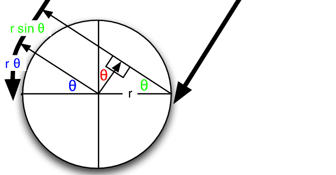
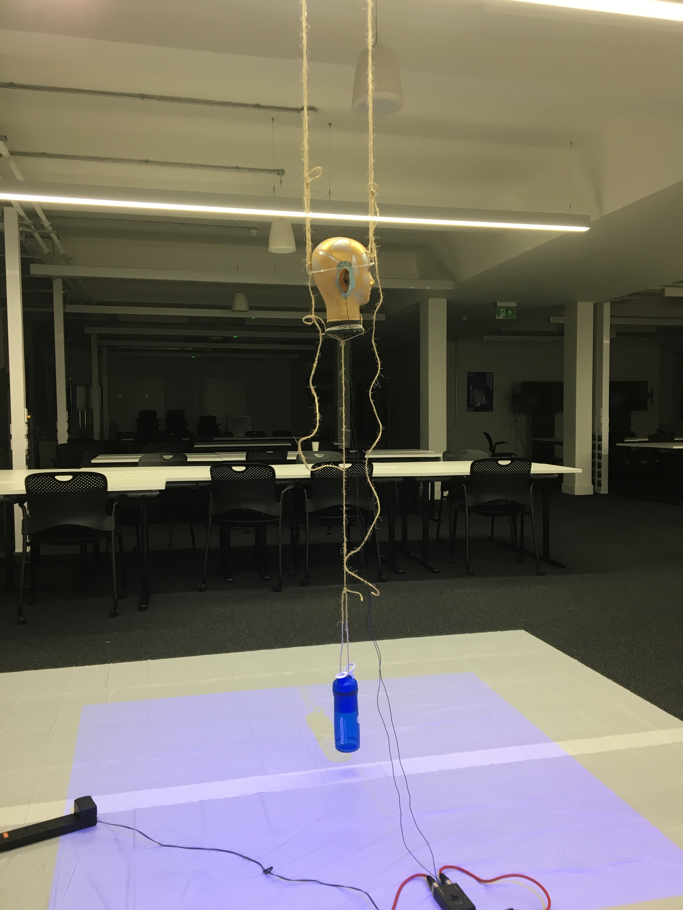
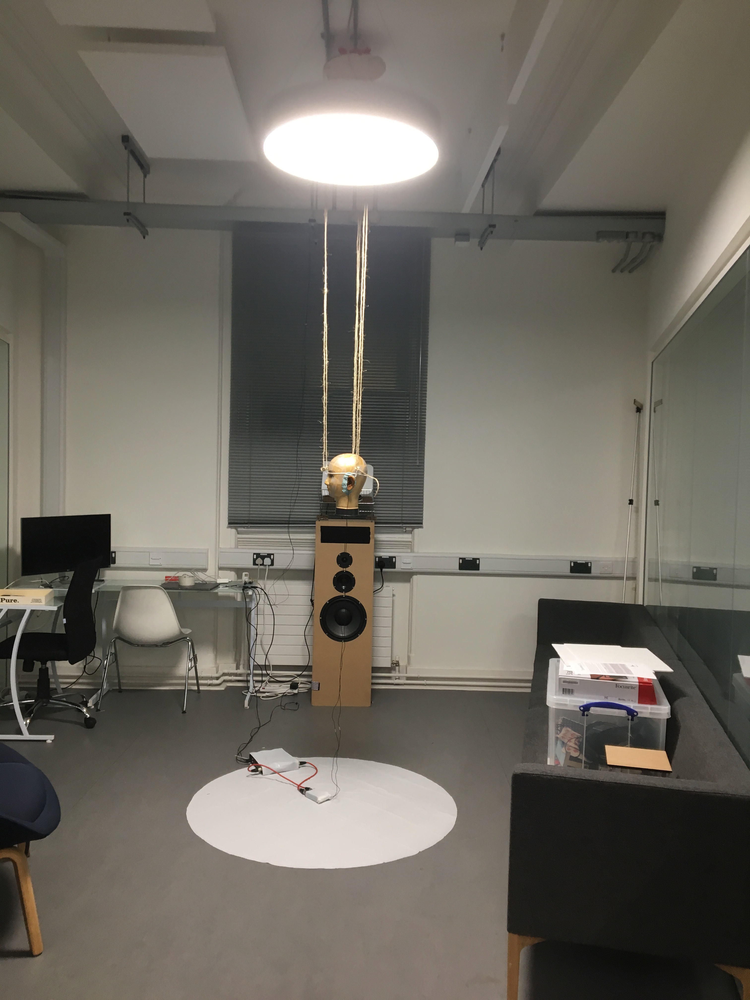

Project Report
========================

*“The music is not in the notes, but in the silence between.”*

*- Wolfgang Amadeus Mozart*

This report outlines work done for the 2019 Audio Experience Design Installation
at Imperial College London. My contribution to this installation involved:

* Generating a mixed synthetic and real 3D audio dataset with over `2000 audio clips`_
* Training a CNN to make heading predictions based on 2 channel audio vectors
* Utilising a probabilistic filter to smooth heading predictions
* Creating an interactive display, with real time audio input, and graphic output

The final result of work was: an interactive audio localisation installation, which utilised
live binaural recordings to make predictions on sound source location.

**Dummy Head with two DPA Lapel Mics**

.. figure::  imgs/dummy_head_side.jpg
   :align:   center

.. _2000 audio clips: https://www.dropbox.com/sh/g511lxn3aminor6/AAA7dM8wifHG5ejbL_bbTKA_a?dl=0

Initial Planning
-------------------------

Project Aims
*************

The initial aims for project were submitted in the `preliminary document`_:

-	*Model Human Audio Localisation*

Fulfilling this criteria was the bulk of the installation work. Ultimately, we were successful
in this endeavour, however, in a simpler case. Humans have the ability to differentiate
between sounds source coming from: left, right, front or back. Our algorithm could predict left or right with 76% accuracy (see figure below).

**Test Accuracy of Algorithm**

.. figure::  imgs/test_acc.png
   :align:   center

-	*Create an Interactive Dark room, where participants can be localised in real time*

The initial vision was to locate sounds of human foot steps in a dark room, and then shine a
a spot light on their location. Early on in the project, it was suggested that utilising
a projector would be simpler then making a custom spotlight. We incorporated this suggestion, and
through testing found that the projector was bright enough to be used in a lit room.

-	*Tie in with educational aspect to explain how our human audio localisation works*

During the Audio Experience day and Dyson Open House we spoke with visitors and explained our installation.

We began our explanation by asking the visitor to close their eyes, and then locate us as we moved around.
The idea was to first illustrate the incredible computation our brains do: localising
sounds in a 3D environment based purely on two auditory signals.

We then explained the process through which this computation is believed to be done (Duplex theory), utilising
inter-aural time difference (ITD) and inter-aural level difference (ILD). We then demonstrated
our installation which modelled this system computationally.

Inevitably, audience members would walk around the head and see poor performance between front and back localisation.
This would then lead to the discussion of cone of confusion, and we would point out that
the ITD and ILD between directly in front and back positions are identical. We also took this opportunity to explain
direction dependent filtering done by our ear pinna's and the role of head movement.

Team Coordination
************************

Team coordination was facilitated by: Messenger, `Github`_, Trello

**Trello Board for Task Assignment**

.. figure::  imgs/trello.png
   :align:   center

.. _preliminary document: https://www.dropbox.com/s/s0ut74x6u8ri9yr/AXP-TeamPingLight.docx?dl=0
.. _Github: https://www.dropbox.com/s/s0ut74x6u8ri9yr/AXP-TeamPingLight.docx?dl=0

Data Generation
-------------------------

The field of *machine listening* is hot. Previous work has utilised large microphone arrays (5+) with custom algorithms and hand picked features [1].
Recent advances in machine learning, however, have made it possible to learn extremely complex functions from data.
These advances are being applied to reach state of the art performance in sound localisation [1].

In line with previous work, our team aimed to train a convolutional neural network (CNN) to predict sound location based on time series audio data. We were most
interested, however, in the method of which we would generate training data, and in utilising only two microphones (mimicking the human system) as suppose to a large microphone array.

3D Tune-In
************

3D Tune-In is an open-source library for real-time binaural spatialisation [2]. Given a mono audio file, it can generate the
corresponding spatialised stereo recording for a point in space relative to the listener. While this mapping is complex,
for our purposes we assumed it to be a black box. Our goal was to approximate the inverse function.
Given a binaural recording, predict the location of the sound relative to the listener. This approximation could be done using a
convolutional neural network (CNN).

Data Generation with MaxSP
***************************

In order to train the CNN, we needed a large dataset with audio clips and corresponding location labels. Rather then generate this
by hand using the offline recording feature in the 3D Tune-In test app, we accomplished this programmatically.

First, we set a 10 minute timer and started an online recording in 3D Tune-In. A script in MaxSP, which interfaced with 3D Tune-In using open sound control (OSC), then
uniformly iterated through various distance and headings, and moved the sound source. As the recording ran, the max patch would write the sound source's current
location into a text file (`example .txt file`_).

**Moving Sound Source using MaxSP**

.. raw:: html

    

        <iframe src="//www.youtube.com/embed/EC2ePor7Wz0" frameborder="0" allowfullscreen style="position: absolute; top: 0; left: 0; width: 100%; height: 100%;"></iframe>
    

|

After 10 mins, the online recording and the max patch were stopped. To utilise the data, a function was written to clip the front and end of the audio data, to
ensure it matched with the labels.

.. _example .txt file: https://github.com/zacharyyamaoka/DE3-Audio/blob/master/data_label/data_rec001.txt

Data Generation with Python
****************************

In order to boost performance, we wanted to make sure that our training data was as close as possible to the test data. We realised we could still interface with the toolkit
using OSC but utilise Python to create a more natural motion pattern. Having natural motion meant that for a given window of data, the source would stay around the same location,
as suppose to teleporting around the sound scape. Data was recorded in the same manner as described above, but now the sound source was moved
by simulating a random polar walker. This random walker walks in circles around the listener (similar to how we imagined people would interact with the dummy head) with
speeds and accelerations similar to the average human [3].

* Average walking speed: 1.4 m/s
* Average walking acceleration over short period of time: 0.86 m/s^2

At each time step, there is a small probability, the walker switches directions.

See code for walker::

  def update(self, dt=0.1):

      #update speed and orientation
      self.timer += dt

      self.r_dot += dt * np.random.normal(0,self.acc_std)
      self.theta_dot += dt * np.random.normal(0,self.acc_std) #in small steps....

      #Move person
      self.r += self.r_dot * dt
      self.theta += self.theta_dot * dt

      # with small probabality switch direction
      if self.timer > 3: # every one second you may switchh

          self.timer = 0

          #with small probability stop, mabye also fixes this unbounded increase problem
          if np.random.random() > 0.8:
              self.theta_dot = 0
          if np.random.random() > 0.8:
              self.r_dot = 0

See walker in action:

.. raw:: html

    

        <iframe src="//www.youtube.com/embed/z80D9Xikr2k" frameborder="0" allowfullscreen style="position: absolute; top: 0; left: 0; width: 100%; height: 100%;"></iframe>
    

|

Real Data Generation
*********************

The best data is data taken from the actually test distribution. To generate this dataset, we set up the dummy head and projector in the same room and configuration as it would shown on the demo day.
The program would then pick a heading direction and display it on the floor. In the background a Python script ran that captured a sound recording every 30s. Essentially: the computer would tell the person where to stand, the person
would move to that location while making sound, then the computer would capture a sound recording.

**Heading Display**

.. raw:: html

    

        <iframe src="//www.youtube.com/embed/8DLFwBuzAxI" frameborder="0" allowfullscreen style="position: absolute; top: 0; left: 0; width: 100%; height: 100%;"></iframe>
    

|

**Following Arrow Around Head while Making Noise**

.. raw:: html

    

        <iframe src="//www.youtube.com/embed/4Zyq-jSEsto" frameborder="0" allowfullscreen style="position: absolute; top: 0; left: 0; width: 100%; height: 100%;"></iframe>
    

|

The great advantage in this approach was that data contained features specific to the dummy head we would use in the installation. ITD, IDL and especially the HRTF are greatly affected by the shape of the head,
body and the ears. The most realistic dataset we could have generated in 3D Tune-In would have utilised the publicly available Kemar HRTF and the real Kemar in the installation.
Instead we generated a fair amount of synthetic data using the incorrect HRTF, and then fine tuned our model using a large amount of real data recorded on the actually head. Such an approach also
allowed us the capture room specific reverb features.

Data Types
-------------------

Data Resolution and Length
****************************

We considered the sampling frequency and bit depth used for the audio, as well as the duration of the prediction window (number of samples).

For synthetic data, 44100 Hz and 16 bit depth was used to capture recordings in 3D Tune-In. For input sounds, Audacity was used to convert Youtube wav files, to the correct sampling frequency and mono track format required by
the toolkit.

For real data, we initially also used 44100 Hz and 16 bit depth. From testing, we visually confirmed that level resolution was sufficiently fine to determine ILD, but it was clear ITD features would improve if we increased sampling frequency.
For sources close to the listener (near-field whisper), level differences are pronounced as the sound level decreases by 6 dB for every doubling of distance. The maximum time delay however, at 44100 Hz, would be just 26 samples.
Thus, also conscious of memory space and realtime requirements, we opted for a 96000 Hz sampling rate. This simply required changing a few parameters in our code and adjusting the sampling frequency on the MOTU Ultralight we
where using to interface with the DPA lapel mics.

**Audio Clips - 480 samples at 96000 Hz**

.. raw:: html

    

        <iframe src="//www.youtube.com/embed/o-H32zXB1Ms" frameborder="0" allowfullscreen style="position: absolute; top: 0; left: 0; width: 100%; height: 100%;"></iframe>
    

|

We tested a number of different window lengths for prediction but ultimately choose a 0.005 second window. At 96000 Hz this corresponds to 480 samples. This choice was made based on the size of the ITD feature we
wanted to capture. Based on the Woodworth's formula for ITD, we knew that the maximum delay on our dummy head would be approximately 0.0006 seconds (assuming the sound travels at 340 m/s) [3].
As our CNN was not integrating information over time, it needed sufficient temporal information to make the correct decision in the moment. Too small, and the important relative information of the sound pressure
wave would be loss. Too large, and the delay features would be obscured. 0.005 seconds seemed right and achieved higher test accuracy compared to larger window sizes.

**Head Parameters for Wood Worth Formula [4]**

Sound Type
**************

Thought was given to what type of sound to use in the data generation. Initially ideas that guided our thinking were:

* *Used the same sound.* The model would require less capacity to localise one sound as suppose to learning to detect the features on many different types of sound.

* *Use constant dB sound*. If the sound level were kept the same, then the model could learn to predict distance

With this in mind we decided upon a rain sound. Rain is an extremely rich signal. There was also an interesting psychological aspect as humans perceive rain to be all around us, but the
computer program would be indifferent.

.. raw:: html

    

        <iframe src="//www.youtube.com/embed/PiHM4WdmQ4o" frameborder="0" allowfullscreen style="position: absolute; top: 0; left: 0; width: 100%; height: 100%;"></iframe>
    

|

It became apparent that this data had too many frequency components (essentially white noise) that were obscuring the ITD features. We felt it would be easier to learn to extract ITD and ILD features
on a simpler wave form. First clapping was tried, we hopped the algorithm would pick up on the clear time and level differences in the impulse peak.

.. raw:: html

    

        <iframe src="//www.youtube.com/embed/cxy7wylUFVw" frameborder="0" allowfullscreen style="position: absolute; top: 0; left: 0; width: 100%; height: 100%;"></iframe>
    

|

Then Beethoven's Moonlight Sonata. Compared to rain, piano sound is relatively pure, consisting mostly of a few main harmonics and their over tones.

.. raw:: html

    

        <iframe src="//www.youtube.com/embed/wGWhmaOE9mM" frameborder="0" allowfullscreen style="position: absolute; top: 0; left: 0; width: 100%; height: 100%;"></iframe>
    

|

Training on the piano music also meant the algorithm would better generalise to other "pure tones", like a constant whistle.

Convolutional Neural Network
-----------------------------

Once the data had been collected, the CNN could be trained. First we over-fit on a small amount of data to validate the model. Then training was
done using the full dataset. Interestingly, we had to start with a high learning rate because the model started in a local minimum. By initialising the weights with
with small random numbers, the initial prediction for any audio single would be a small random number (around 0 deg). This is a good starting point, but learning to predict
+90 or -90 deg, depending on wether the sound in on the left or right is the global minima. This is because the model cannot differentiate between front and back (cone of confusion).

**Training the CNN with Audio Data**

.. raw:: html

    

        <iframe src="//www.youtube.com/embed/F0cH7pZOYvQ" frameborder="0" allowfullscreen style="position: absolute; top: 0; left: 0; width: 100%; height: 100%;"></iframe>
    

|

Loss Function
****************

Care had to be given to how we penalised the CNN's predictions vs the actual heading. Utilising a euclidean distance metric, does not correctly measure the difference between angles. The "straight line"
distance between pi and -pi is 2 pi – the angular difference is 0. Instead we implemented a function to calculate the smallest angle between two headings::

  def abs_radial_loss(h,y):
      """" Calculates difference angular difference between pred - h and label - y""""
      global batch_size

      x = torch.abs(h.sub(y))
      x = torch.abs(x - np.pi)
      x = np.pi - x
      x = torch.abs(x) # must be positive
      x = torch.sum(x)
      x = x/batch_size

      return x

Improvements
-----------------------------

We made a number of improvements to improve our audio localisation algorithm's performance.

1. We created a data set using a pure sinusoid at 1.6 kHz with background noise. While this would make it impossible to detect direction dependent features, it would be simpler to for the algorithm to
extract ITD and ILD. The background noise would also make the prediction more robust in real settings.

.. raw:: html

    

        <iframe src="//www.youtube.com/embed/ThffOQjV17k" frameborder="0" allowfullscreen style="position: absolute; top: 0; left: 0; width: 100%; height: 100%;"></iframe>
    

|

2. We normalised and mean centred the data::

    audio = audio[:, start:(start+chunk)]

    #center data
    mean = np.mean(audio)
    audio -= mean

    #normalize

    max = np.max(np.abs(audio))
    audio /= max

While this removed distance information, it gave improved robustness to level differences and background noise (like that found in the installation)

3. We changed the localisation task from regression to classification problem. Previously our CNN was trained to predict source heading on a continuous range between 0 and 2 pi. Now it would simply predict left or
right.

.. raw:: html

    

        <iframe src="//www.youtube.com/embed/dCLHqfuBEFc" frameborder="0" allowfullscreen style="position: absolute; top: 0; left: 0; width: 100%; height: 100%;"></iframe>
    

|

4. Added head movement. While previously mentioned changes lowered our angular resolution, this decrease could be offset by adding head movement. Slight head movement is a
technique used by humans to differentiate between front and back sound sources. In implementation, our dummy head was moved by a 5v servo motor powered by an Arduino Uno.

.. raw:: html

    

        <iframe src="//www.youtube.com/embed/NIZqMI7LmdQ" frameborder="0" allowfullscreen style="position: absolute; top: 0; left: 0; width: 100%; height: 100%;"></iframe>
    

|

5. Added a probabilistic filter. In order to utilise head movement information, predictions needed to be integrated over time. For this, a discrete Bayes filter is utilised.

Filtering
*********

Initially, filtering of the predictions was done using a simple moving average filter::

  def filter(self, last_theta_mu, last_theta_var):

        # simple moving average filter.
        last_theta_mu = last_theta_mu % (2 * np.pi) #modulo
        self.theta_mu[self.pointer] = last_theta_mu
        self.theta_var[self.pointer] = last_theta_var

        self.pointer += 1
        self.pointer = self.pointer % self.size #add wrap around

        curr_theta_mu = np.mean(self.theta_mu)
        curr_theta_var = np.var(self.theta_var)

        return curr_theta_mu, curr_theta_var

In order to achieve more consistent performance, however, it became clear that a more powerful filter would be needed.
The final algorithm used a discrete Bayes filter which is more robust to spurious predictions and can
integrate predictions over time to account for head movement.

.. raw:: html

    

        <iframe src="//www.youtube.com/embed/eWNau435xrc" frameborder="0" allowfullscreen style="position: absolute; top: 0; left: 0; width: 100%; height: 100%;"></iframe>
    

|

We model the sound source as a random particle that experiences a small gaussian drift each time step::

  def motion_update(self,dt=0.1):
      #assume randomly left or right motion.....
      norm = 0
      new_bel = np.zeros(self.n)

      drift_constant = self.drift * dt #function of dt and drift rate

      for i in np.arange(self.n):
          new_p = 0
          theta = self.bin_ind_2_theta(i)
          for j in np.arange(self.n):
              theta_j = self.bin_ind_2_theta(j)
              d = self.angle_delta(theta,theta_j)

              mul = np.exp(-d/(2*drift_constant))
              new_p += mul * self.bel[j] #integrate belief from all theta

          new_bel[i] = new_p
          norm += new_p
      new_bel /= norm
      self.bel = new_bel

The prediction is also modelled using a gaussian with a variance of 180 degrees, to reflect the fact the head cannot differentiate front from back::

  def sensor_update(self, theta_mu, var=np.pi): #update with sensor reading and accuracy

        new_bel = np.zeros(self.n)
        total_p = 0

        for i in np.arange(self.n): #for each bin update with likelihood of measurement
            x = self.bin_ind_2_theta(i) #find the center of the bin

            likelihood = self.eval_gaussian(x,theta_mu,var)

            new_p = likelihood * self.bel[i]
            new_bel[i] = new_p
            total_p += new_p

        new_bel /= total_p #normalize afterwards

        self.bel = new_bel #replace old belief

Find full code in file `filter.py`_

Now representing our prediction as a belief between 0 and 2 pi, we felt it would be more suitable to change our graphic display. At Audio Experince Day, we used a single slice of a circle, pointing in the
direction of our prediction. For the Open House, a MaxSP patch was created which wrapped the belief distribution around a circle. The highest point in the histogram represented the heading prediction with
the greatest probability.

.. raw:: html

    

        <iframe src="//www.youtube.com/embed/Itsho3N23gU" frameborder="0" allowfullscreen style="position: absolute; top: 0; left: 0; width: 100%; height: 100%;"></iframe>
    

|

.. _filter.py: https://github.com/zacharyyamaoka/DE3-Audio/blob/master/algo/filter.py

Final Outcome
-----------------

**Initial Set Up**

**Audio Experience Day**

 .. figure::  imgs/v2_head.jpg
    :align:   center

**Dyson Open House**

**Live Binaural Localization**

.. raw:: html

    

        <iframe src="//www.youtube.com/embed/GGU_w7pQqGI" frameborder="0" allowfullscreen style="position: absolute; top: 0; left: 0; width: 100%; height: 100%;"></iframe>
    

|

References
-----------------

[1] Vera-Diaz, Juan Manuel, et al.
“Towards End-to-End Acoustic Localization Using Deep Learning: From Audio Signal to Source Position Coordinates.”
2018, doi:10.20944/preprints201807.0570.v1.

[2] Cuevas-Rodríguez M, Picinali L, González-Toledo D, et al., 2019,
3D Tune-In Toolkit: An open-source library for real-time binaural spatialisation,
Plos One, Vol:14, Pages:e0211899-e0211899

[3] Lawrence, Peter.
“What Is the Maximum Walking Acceleration/Deceleration over a Very Short Time Period (E.g., 0.02, 0.1, 0.5 Sec)?”
ResearchGate, 8 Aug. 2016, www.researchgate.net/post/What_is_the_maximum_walking_acceleration_deceleration_over_a_very_short_time_period_eg_002_01_05_sec.

[4] Cohen, Michael. (2010). Under-explored dimensions in spatial sound. 10.1145/1900179.1900199.

´
